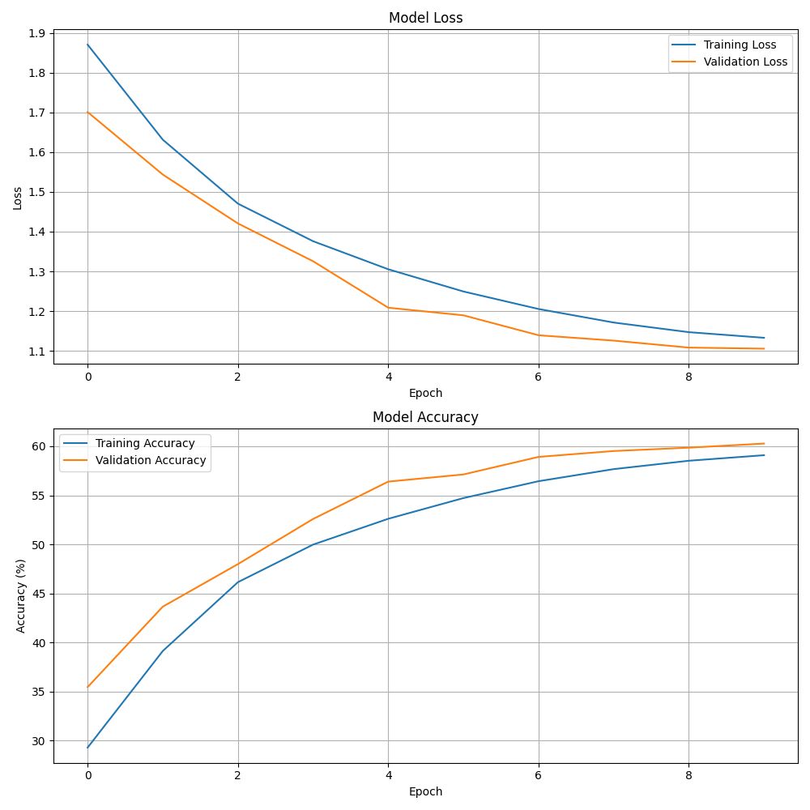

# Vision Transformer for CIFAR-10

PyTorch implementation of Vision Transformer (ViT) for CIFAR-10 image classification, featuring checkpoint management, early stopping, and performance analysis.

## Project Structure
```
.
├── dataset.py          # Data loading and augmentation
├── evaluate.py         # Model evaluation functions
├── main.py            # CLI and main execution
├── model.py           # Vision Transformer implementation
├── train.py           # Training loop and utilities
├── utils.py           # Helper functions
└── requirements.txt   # Project dependencies
```

## Setup
```bash
pip install -r requirements.txt
```

Dependencies:
- PyTorch
- torchvision
- tqdm
- matplotlib
- numpy

## Model Architecture

### Components
- Patch embedding layer (4x4 patches)
- Learnable position embeddings
- Multi-head self-attention
- Layer normalization
- MLP blocks
- Classification head

### Parameters
#### Model Configuration
- `--embed-dim`: Embedding dimension (default: 192)
- `--num-heads`: Attention heads (default: 8)
- `--num-layers`: Transformer layers (default: 12)
- `--mlp-ratio`: MLP expansion ratio (default: 4)

#### Training Configuration
- `--batch-size`: Batch size (default: 128)
- `--epochs`: Training epochs (default: 100)
- `--lr`: Learning rate (default: 3e-4)
- `--weight-decay`: Weight decay (default: 0.05)
- `--dropout`: Dropout rate (default: 0.1)
- `--patience`: Early stopping patience (default: 7)

#### Other Settings
- `--mode`: 'train' or 'test'
- `--seed`: Random seed (default: 42)
- `--checkpoint-dir`: Checkpoint directory (default: 'checkpoints')
- `--checkpoint-path`: Specific checkpoint path for testing

## Command Line Examples

### Training Models

```bash
# Basic training with defaults
python main.py --mode train

# Small model (limited memory: 4GB VRAM)
python main.py --mode train \
    --embed-dim 128 \
    --num-layers 6 \
    --batch-size 64 \
    --epochs 50

# Standard model (8GB VRAM)
python main.py --mode train \
    --embed-dim 192 \
    --num-layers 12 \
    --batch-size 128 \
    --epochs 100 \
    --lr 3e-4

# Large model (16GB+ VRAM)
python main.py --mode train \
    --embed-dim 384 \
    --num-layers 12 \
    --batch-size 256 \
    --epochs 200
```

### Testing Models

```bash
# Test latest checkpoint
python main.py --mode test

# Test specific checkpoint
python main.py --mode test \
    --checkpoint-path checkpoints/model_epoch50.pt \
    --embed-dim 192 \
    --num-layers 12
```

### Advanced Configurations

```bash
# Prevent overfitting
python main.py --mode train \
    --dropout 0.2 \
    --weight-decay 0.1 \
    --patience 10

# Memory optimization
python main.py --mode train \
    --embed-dim 96 \
    --num-layers 6 \
    --batch-size 32

# Reproducible training
python main.py --mode train \
    --seed 42 \
    --embed-dim 192 \
    --num-layers 12
```

## Performance Analysis

### Training History Visualization
`training_history.png` displays training metrics:



### Understanding the Plots

#### Loss Curves (Top)
- Blue: Training Loss
- Orange: Validation Loss
- Patterns:
  - Healthy: Smooth decrease in both curves
  - Overfitting: Diverging curves
  - Underfitting: High plateau
  - LR issues: Unstable curves

#### Accuracy Curves (Bottom)
- Blue: Training Accuracy
- Orange: Validation Accuracy
- Expected range: 50-75%
- Patterns:
  - Good: Stable plateau
  - Overfitting: Large train/val gap
  - Underfitting: Low accuracy

### Common Issues
- Oscillating loss → Reduce learning rate
- Flat curves → Increase learning rate
- Diverging metrics → Increase regularization
- Training spikes → Reduce batch size